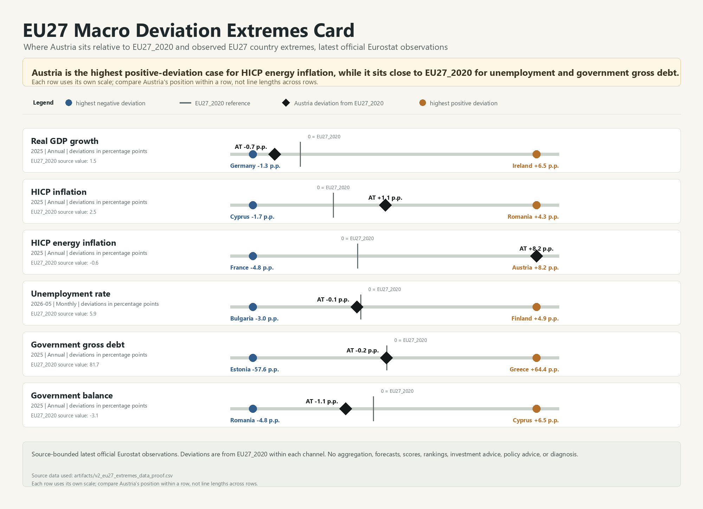

# Austria vs EU27_2020 — Macro Deviation Extremes Card

## Project question

Where does Austria sit relative to EU27_2020 and the observed EU27 country-deviation extremes across selected official macro indicators?

## What this project shows

This repository contains a source-bounded macro analytics artifact built from latest available official Eurostat observations.

The card compares Austria with:

- EU27_2020 as the reference point,
- the observed highest negative country deviation within the selected EU27 country set,
- the observed highest positive country deviation within the selected EU27 country set.

Each row is a separate macro channel. The visual is designed to show Austria's position within each channel's observed deviation range, not to aggregate channels into a score.

## Strongest bounded observation

Within the selected latest official Eurostat observations, Austria is the highest positive-deviation case for HICP energy inflation, while it sits close to EU27_2020 for unemployment and general government gross debt.

This is a source-bounded observation, not a forecast, score, ranking, policy conclusion, investment signal, or crisis diagnosis.

## Included indicators

The current artifact uses selected official Eurostat indicators for:

- real GDP growth,
- HICP inflation,
- HICP energy inflation,
- unemployment rate,
- general government gross debt as percent of GDP,
- general government deficit or surplus as percent of GDP.

## How to read the card

- EU27_2020 is shown as the zero-deviation reference.
- Austria is shown as a deviation from EU27_2020 within each indicator channel.
- The left and right endpoints show the observed negative and positive EU27 country-deviation extremes for that channel.
- Each row uses its own scale.
- Row lengths should not be compared across indicators.
- Periods and frequencies can differ by indicator, because the card uses latest available official observations.

## Data and source boundary

The project uses official Eurostat observations recorded in the repository data files.

Key files:

- `data/source_registry.csv` — validated source paths and source notes.
- `data/official_macro_indicators.csv` — latest available official observations for Austria and EU27_2020.
- `data/latest_official_macro_stress_matrix.csv` — source-bounded latest-observation matrix.

Note: `data/latest_official_macro_stress_matrix.csv` preserves an earlier working filename. The public interpretation is a source-bounded observation matrix, not a stress score or early-warning system.

## Method summary

The method is intentionally simple and bounded:

1. Select official Eurostat source paths for the included macro indicators.
2. Retrieve latest available official observations for Austria, EU27_2020 and relevant EU27 country comparison points.
3. Preserve period, frequency, unit, source ID and boundary notes.
4. Calculate deviation from EU27_2020 within each indicator channel.
5. Visualize Austria's position relative to observed EU27 country-deviation extremes.
6. Avoid aggregation into a composite score or country-risk classification.

See `methodology.md`, `data_sources.md` and `claim_boundary.md` for details.

## What this project is not

This project is not:

- not a forecast,
- not a stress score,
- not a country-risk ranking,
- not an investment signal,
- not policy advice,
- not a crisis diagnosis,
- not a real-time monitoring system,
- not complete macroeconomic coverage,
- not a claim that latest observations represent synchronized real-time economic conditions.

## Portfolio value

This project demonstrates:

- official data handling,
- source-bounded macro comparison,
- indicator-level deviation logic,
- visual communication of a bounded analytical observation,
- public documentation with explicit claim boundaries.

## Main artifact

- `artifacts/eu27_macro_deviation_extremes_card.png`
- `artifacts/eu27_macro_deviation_extremes_card_notes.md`

## Suggested repository description

Source-bounded Austria vs EU27_2020 macro deviation card using latest official Eurostat observations; no forecasts, scores, rankings, investment or policy advice.

